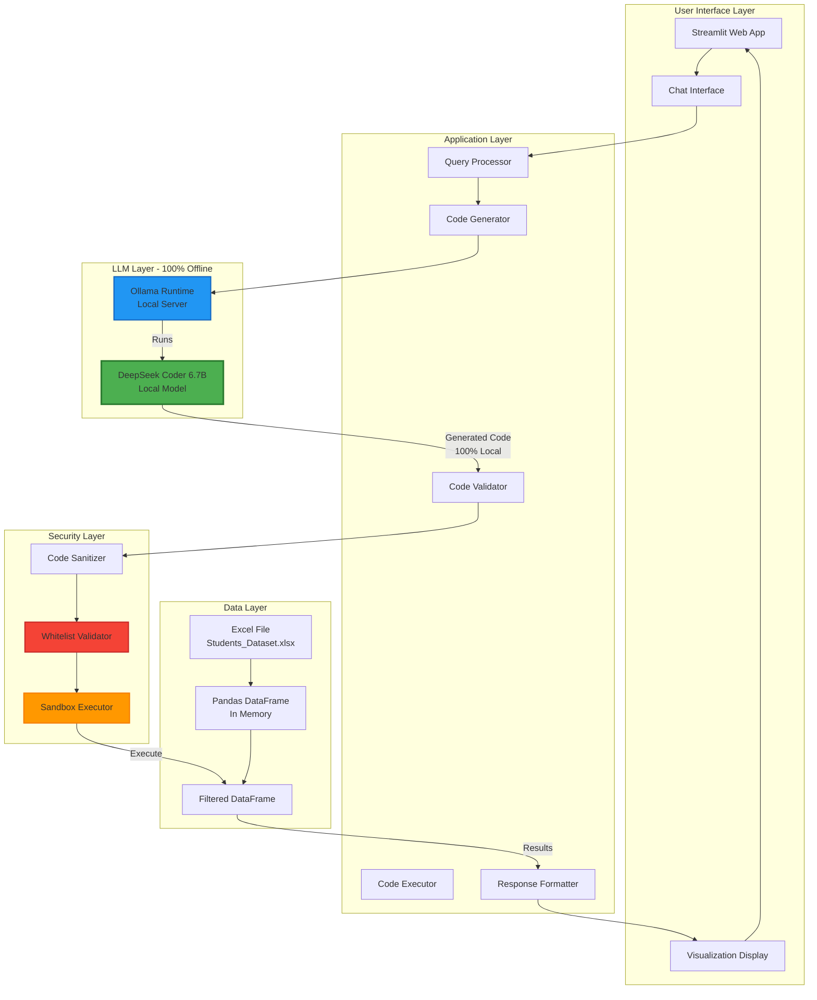
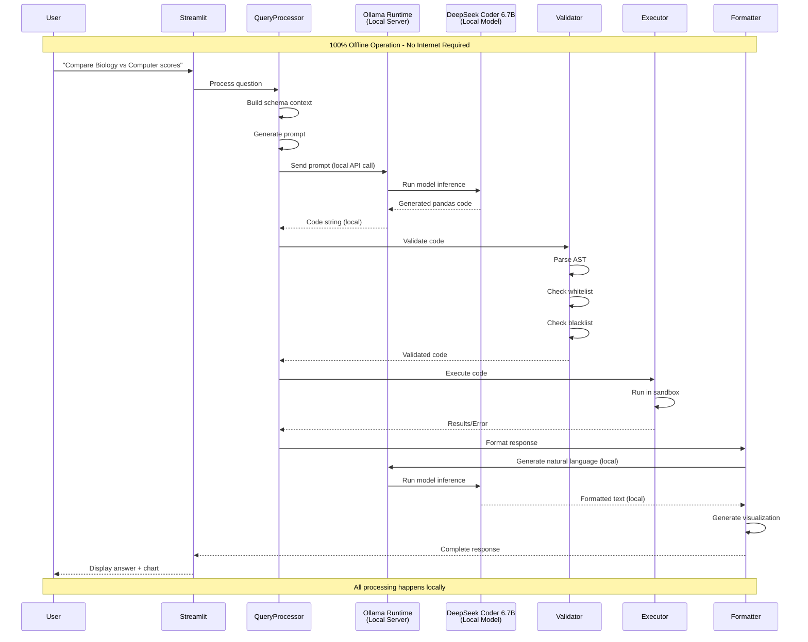
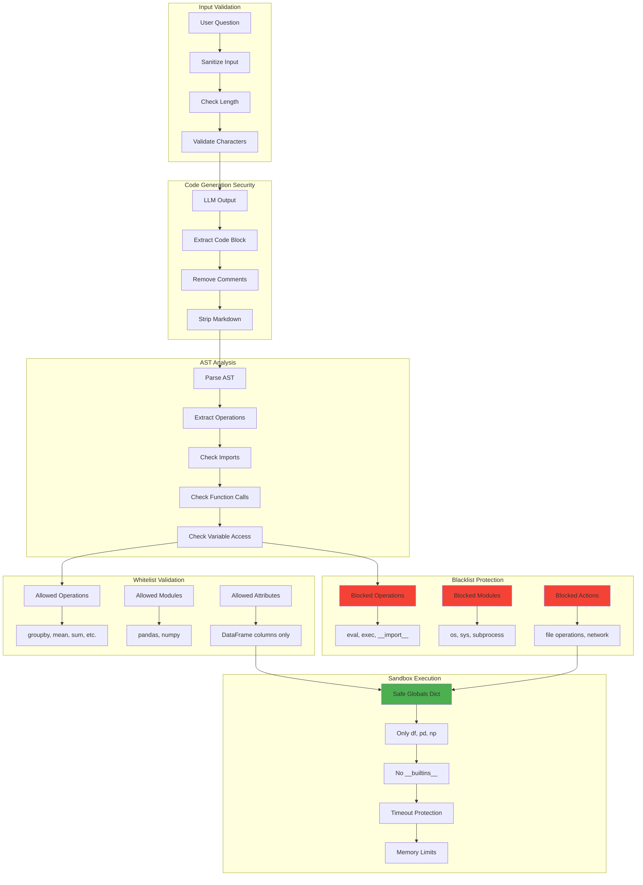

# Educational Data Chatbot - Comprehensive Architecture Plan

## 📋 Table of Contents
1. [System Overview](#system-overview)
2. [Architecture Diagrams](#architecture-diagrams)
3. [Data Schema](#data-schema)
4. [Component Architecture](#component-architecture)
5. [Data Flow](#data-flow)
6. [Security Architecture](#security-architecture)
7. [Technology Stack](#technology-stack)
8. [Implementation Plan](#implementation-plan)
9. [API Specifications](#api-specifications)

---

## 🎯 Architecture Overview

### Complete Offline Operation

This system is **100% offline** - no internet connection required after initial setup. All components run locally:

- **Ollama**: Local runtime/server that manages LLM models (like a local API server)
- **DeepSeek Coder 6.7B**: The AI model that runs **inside** Ollama to generate pandas code
- **All Processing**: Data, code generation, execution, and responses happen entirely on your machine

**Think of it like:**
- Ollama = The engine/car (runtime infrastructure)
- DeepSeek Coder 6.7B = The fuel/model (the actual AI)

**Not two models** - Ollama is the infrastructure that runs the DeepSeek model.

---

## System Overview

### Vision
A **100% offline, secure, intelligent chatbot** that allows users to query educational student data using natural language. The system generates pandas code dynamically using **DeepSeek Coder 6.7B** (running locally via Ollama runtime), executes it safely, and returns formatted insights. **No internet connection required, no API calls, complete data privacy.**

### Key Features
- ✅ **100% Offline Operation** - Everything runs locally, no internet needed
- ✅ **Natural Language Queries** - Ask questions in plain English
- ✅ **Dynamic Pandas Code Generation** - DeepSeek Coder 6.7B generates code on-the-fly
- ✅ **Local LLM** - DeepSeek Coder 6.7B runs via Ollama runtime (local server)
- ✅ **Zero API Costs** - No external services, complete privacy
- ✅ **Secure Execution** - Sandboxed code execution with validation
- ✅ **Streamlit UI** - Modern, interactive web interface
- ✅ **Real-time Visualizations** - Automatic chart generation

### Design Principles
1. **Complete Offline Operation** - No external dependencies, all processing local
2. **Security First** - All code execution is sandboxed and validated
3. **Privacy** - All processing happens locally, no data ever leaves the system
4. **Flexibility** - Can answer any question about the data
5. **Maintainability** - Clean, modular architecture
6. **Performance** - Efficient code generation and execution

---

## Architecture Diagrams

### High-Level System Architecture



### Detailed Component Architecture

```mermaid
graph LR
    subgraph "Query Processing Pipeline"
        A1[User Question] --> A2[Question Analyzer]
        A2 --> A3[Schema Context Builder]
        A3 --> A4[Prompt Generator]
    end
    
    subgraph "Code Generation - Offline"
        B1[LLM Prompt] --> B2[Ollama Runtime]
        B2 --> B3[DeepSeek Coder 6.7B<br/>Local Model]
        B3 --> B4[Raw Code String]
        B4 --> B5[Code Extractor]
        B5 --> B6[Cleaned Code]
    end
    
    subgraph "Security & Validation"
        C1[Code Parser] --> C2[AST Analyzer]
        C2 --> C3[Whitelist Check]
        C3 --> C4[Blacklist Check]
        C4 --> C5[Variable Check]
        C5 --> C6[Sanitized Code]
    end
    
    subgraph "Execution"
        D1[Safe Globals] --> D2[Execute Code]
        D2 --> D3[Capture Results]
        D3 --> D4[Error Handler]
    end
    
    subgraph "Response Generation"
        E1[Results] --> E2[Data Formatter]
        E2 --> E3[Visualization Generator]
        E3 --> E4[LLM Response Formatter]
        E4 --> E5[Final Response]
    end
    
    A4 --> B1
    B6 --> C1
    C6 --> D1
    D3 --> E1
    
    style B2 fill:#2196F3
    style B3 fill:#4CAF50
    style C3 fill:#F44336
    style C4 fill:#F44336
    style D2 fill:#FF9800
```



### Data Flow Sequence



### Security Architecture



---

## Data Schema

### Dataset: Students_Dataset.xlsx

**Shape:** 2,680 rows × 11 columns

| Column Name | Data Type | Description | Example Values |
|------------|-----------|-------------|----------------|
| `student_id` | int | Unique student identifier | 1000, 1001, 1002 |
| `student_name` | string | Student's name | Student_1000, Student_1001 |
| `student_gender` | string | Gender (M/F) | M, F |
| `class_level` | string | Class level | C1, C2, C3, C4, C5 |
| `course_name` | string | Course name | Mathematics, Biology, Computer Science, Chemistry |
| `assessment_no` | int | Assessment number | 1, 2, 3, ... |
| `assessment_score` | float | Score out of 100 | 68.0, 78.0, 85.5 |
| `raised_hand_count` | int | Number of times hand raised | 14, 18, 22 |
| `moodle_views` | int | Moodle platform views | 42, 22, 35 |
| `attendance_rate` | float | Attendance percentage | 67.0, 70.0, 85.5 |
| `resources_downloads` | int | Resource downloads count | 20, 10, 15 |

### Data Relationships
- **One-to-Many**: One student can have multiple assessments
- **Many-to-Many**: Students can take multiple courses
- **Temporal**: Multiple assessments per student per course

### Sample Queries Supported
- Course comparisons: "Compare Biology vs Computer Science"
- Gender analysis: "How do male vs female students perform?"
- Class level analysis: "Which class level performs best?"
- Correlation analysis: "Does attendance correlate with scores?"
- Trend analysis: "Show improvement trends over assessments"
- Statistical queries: "What's the standard deviation of scores?"

---

## Component Architecture

### 1. Query Processor (`query_processor.py`)

**Responsibilities:**
- Parse user questions
- Build context with data schema
- Generate prompts for LLM
- Coordinate the entire pipeline

**Key Methods:**
```python
class QueryProcessor:
    def process_question(question: str, df: pd.DataFrame) -> QueryResult
    def build_schema_context(df: pd.DataFrame) -> str
    def generate_prompt(question: str, schema: str) -> str
    def extract_code_from_response(response: str) -> str
```

### 2. Code Generator (`code_generator.py`)

**Responsibilities:**
- Interface with Ollama/DeepSeek Coder
- Generate pandas code from prompts
- Extract and clean code from LLM response

**Key Methods:**
```python
class CodeGenerator:
    def __init__(ollama_client)
    def generate_code(prompt: str) -> str
    def extract_code_block(response: str) -> str
    def clean_code(code: str) -> str
```

### 3. Code Validator (`code_validator.py`)

**Responsibilities:**
- Parse code into AST
- Validate against whitelist/blacklist
- Check for security violations
- Sanitize code

**Key Methods:**
```python
class CodeValidator:
    ALLOWED_OPERATIONS = ['groupby', 'mean', 'sum', 'count', ...]
    BLOCKED_OPERATIONS = ['eval', 'exec', '__import__', ...]
    
    def validate(code: str) -> ValidationResult
    def parse_ast(code: str) -> ast.AST
    def check_whitelist(ast_node: ast.AST) -> bool
    def check_blacklist(ast_node: ast.AST) -> bool
```

### 4. Code Executor (`code_executor.py`)

**Responsibilities:**
- Execute validated code in sandbox
- Handle errors gracefully
- Capture results
- Enforce timeouts and memory limits

**Key Methods:**
```python
class CodeExecutor:
    def execute(code: str, df: pd.DataFrame) -> ExecutionResult
    def create_safe_globals(df: pd.DataFrame) -> dict
    def run_with_timeout(code: str, timeout: int = 10) -> Any
    def handle_errors(exception: Exception) -> str
```

### 5. Response Formatter (`response_formatter.py`)

**Responsibilities:**
- Format execution results
- Generate visualizations
- Create natural language responses
- Structure final output

**Key Methods:**
```python
class ResponseFormatter:
    def format_results(results: Any, question: str) -> FormattedResponse
    def generate_visualization(results: Any, question: str) -> Optional[Figure]
    def create_natural_language_response(results: Any, question: str) -> str
```

### 6. Streamlit UI (`app.py`)

**Responsibilities:**
- User interface
- Chat management
- Display responses and charts
- Handle user interactions

**Key Components:**
- Chat interface
- Message history
- Visualization display
- Filter sidebar (optional)

---

## Data Flow

### Complete Request Flow

```
1. USER INPUT
   ↓
2. STREAMLIT UI
   - Capture question
   - Add to chat history
   ↓
3. QUERY PROCESSOR
   - Load filtered DataFrame
   - Build schema context
   - Generate prompt with:
     * User question
     * DataFrame schema
     * Column descriptions
     * Example queries
   ↓
4. CODE GENERATOR
   - Send prompt to Ollama
   - DeepSeek Coder generates pandas code
   - Extract code from markdown/response
   ↓
5. CODE VALIDATOR
   - Parse code to AST
   - Check whitelist (allowed operations)
   - Check blacklist (dangerous operations)
   - Validate variable access (only 'df')
   - Sanitize code
   ↓
6. CODE EXECUTOR
   - Create safe execution environment
   - Execute code with timeout
   - Capture results or errors
   ↓
7. RESPONSE FORMATTER
   - Format results (DataFrame, Series, scalar)
   - Generate visualization if applicable
   - Create natural language explanation
   ↓
8. STREAMLIT UI
   - Display formatted response
   - Show visualization
   - Update chat history
```

### Error Handling Flow

```
ERROR DETECTED
   ↓
ERROR TYPE?
   ├─> Code Generation Error
   │   └─> Retry with simpler prompt
   │
   ├─> Validation Error
   │   └─> Return error message to user
   │
   ├─> Execution Error
   │   ├─> Syntax Error → Show to user
   │   ├─> Runtime Error → Show helpful message
   │   └─> Timeout → Suggest simpler query
   │
   └─> LLM Response Error
       └─> Fallback to basic response
```

---

## Security Architecture

### Modern Security Terminology

Following current best practices and inclusive language standards, this architecture uses:
- **Allowlist** instead of "Whitelist" - list of approved/allowed operations
- **Denylist** instead of "Blacklist" - list of explicitly blocked operations
- **Greylist** - list of operations requiring verification

This terminology is more inclusive and accurately describes the security function.

### Security Layers

#### Layer 1: Input Sanitization
- **Purpose**: Prevent injection attacks
- **Measures**:
  - Validate input length (max 1000 chars)
  - Sanitize special characters
  - Check for SQL injection patterns
  - Validate encoding

#### Layer 2: Code Generation Security
- **Purpose**: Ensure LLM generates safe code
- **Measures**:
  - Prompt engineering to guide safe code
  - Post-processing to remove comments
  - Extract only code blocks
  - Remove markdown formatting

#### Layer 3: AST Analysis
- **Purpose**: Deep code analysis before execution
- **Measures**:
  - Parse code to Abstract Syntax Tree
  - Extract all function calls
  - Extract all imports
  - Extract all variable accesses
  - Check for nested dangerous operations

#### Layer 4: Allowlist Validation (Modern Whitelisting)
- **Purpose**: Only allow safe operations (default-deny approach)
- **Modern Best Practice**: Use "allowlist" terminology (more inclusive than "whitelist")
- **Strategy**: Default-deny - only explicitly allowed operations pass
- **Allowed Operations**:
  ```python
  ALLOWLIST = [
      # DataFrame operations
      'groupby', 'agg', 'aggregate', 'apply', 'transform',
      # Statistical operations
      'mean', 'sum', 'count', 'std', 'var', 'min', 'max',
      'median', 'quantile', 'describe', 'mode',
      # Filtering
      'filter', 'query', 'loc', 'iloc', 'isin', 'contains',
      'between', 'isna', 'notna', 'dropna', 'fillna',
      # Transformations
      'merge', 'join', 'concat', 'pivot', 'melt',
      # Analysis
      'corr', 'cov', 'value_counts', 'unique', 'nunique',
      # Sorting
      'sort_values', 'sort_index', 'reset_index', 'set_index',
      # Selection
      'head', 'tail', 'sample', 'drop_duplicates'
  ]
  ```
- **Advantages**: 
  - Highest security - only known safe operations allowed
  - Prevents zero-day exploits of unknown operations
  - Explicit control over what can execute

#### Layer 5: Denylist Protection (Modern Blacklisting)
- **Purpose**: Explicitly block dangerous operations (defense-in-depth)
- **Modern Best Practice**: Use "denylist" terminology (more inclusive than "blacklist")
- **Strategy**: Defense-in-depth - even if something slips through allowlist, block known threats
- **Blocked Operations**:
  ```python
  DENYLIST = [
      # Code execution (critical)
      'eval', 'exec', 'compile', '__import__', 'execfile',
      # File operations
      'open', 'file', 'read', 'write', 'remove', 'delete',
      'rmdir', 'mkdir', 'chmod', 'chown', 'unlink',
      # System operations
      'system', 'popen', 'call', 'run', 'spawn', 'kill',
      # Network operations
      'socket', 'urllib', 'requests', 'http', 'ftp', 'smtp',
      # Dangerous builtins
      '__builtins__', '__globals__', '__locals__', '__dict__',
      '__class__', '__bases__', '__subclasses__', '__getattribute__',
      # Reflection/metaprogramming
      'getattr', 'setattr', 'delattr', 'hasattr',
      # Pickle/serialization
      'pickle', 'marshal', 'dill'
  ]
  ```
- **Blocked Modules**:
  ```python
  DENYLIST_MODULES = {
      'os', 'sys', 'subprocess', 'shutil', 'pickle',
      'socket', 'urllib', 'requests', 'http', 'ftplib',
      'sqlite3', 'ctypes', 'multiprocessing', 'threading'
  }
  ```
- **Advantages**:
  - Defense-in-depth layer
  - Catches known dangerous patterns
  - Protects against allowlist bypass attempts

#### Layer 5.5: Greylisting (Modern Hybrid Approach)
- **Purpose**: Temporarily block unknown operations until verified
- **Modern Best Practice**: Three-tier approach (Allowlist → Greylist → Denylist)
- **Strategy**: 
  - Operations not in allowlist or denylist → Greylist
  - Require explicit approval or pattern matching
  - Can be auto-approved if pattern matches safe operations
- **Implementation**:
  ```python
  GREYLIST = {
      # Unknown operations that need verification
      # Pattern-based approval:
      # - If matches safe pattern (e.g., df.*) → allow
      # - If matches dangerous pattern → deny
      # - Otherwise → require manual review or deny
  }
  ```
- **Advantages**:
  - Balances security and flexibility
  - Allows for dynamic learning
  - Provides audit trail for unknown operations

#### Layer 6: Sandbox Execution
- **Purpose**: Isolated code execution
- **Measures**:
  ```python
  safe_globals = {
      'df': filtered_df,  # Only the DataFrame
      'pd': pd,           # Pandas only
      'np': np            # NumPy only
  }
  safe_locals = {}
  
  # No __builtins__ access
  # Timeout protection (10 seconds)
  # Memory limits
  # Exception handling
  ```

### Modern Security Best Practices

#### 1. Hybrid Approach (Allowlist + Denylist + Greylist)
- **Allowlist (Primary)**: Default-deny, only explicitly allowed operations
- **Denylist (Defense-in-Depth)**: Explicitly block known dangerous operations
- **Greylist (Flexibility)**: Handle unknown operations with verification

#### 2. AST-Based Deep Analysis
- Parse code to Abstract Syntax Tree before execution
- Analyze all nodes (calls, imports, attributes, variables)
- Check nested operations and chained calls
- Validate at multiple levels (syntax, semantic, security)

#### 3. Pattern-Based Validation
- Use regex patterns to catch dangerous code patterns
- Check for code injection attempts
- Validate string formatting (f-strings, format(), %)
- Detect obfuscation attempts

#### 4. Context-Aware Validation
- Consider operation context (e.g., `df.groupby()` is safe, but `os.system()` is not)
- Validate operation chains (e.g., `df.groupby().mean()` vs `df.groupby().eval()`)
- Check variable scoping and access patterns

#### 5. Progressive Security
- Start with strict allowlist
- Learn from patterns (optional ML-based enhancement)
- Maintain audit logs for security analysis
- Regular security reviews and updates

### Security Checklist

- [x] Input validation and sanitization
- [x] AST-based deep code analysis
- [x] **Allowlist** of allowed operations (default-deny)
- [x] **Denylist** of dangerous operations (defense-in-depth)
- [x] **Greylist** for unknown operations (hybrid approach)
- [x] Pattern-based validation (regex, AST patterns)
- [x] Context-aware operation checking
- [x] Sandboxed execution environment
- [x] Timeout protection
- [x] Memory limits
- [x] Error handling without information leakage
- [x] No file system access
- [x] No network access
- [x] No system command execution
- [x] Audit logging for security analysis

---

## Technology Stack

### Core Technologies

| Component | Technology | Version | Purpose | Offline Status |
|-----------|-----------|---------|---------|----------------|
| **UI Framework** | Streamlit | Latest | Web interface | ✅ 100% Local |
| **Data Processing** | Pandas | Latest | Data manipulation | ✅ 100% Local |
| **LLM Runtime** | Ollama | Latest | Local LLM runtime/server | ✅ 100% Local |
| **LLM Model** | DeepSeek Coder | 6.7B | Code generation (runs via Ollama) | ✅ 100% Local |
| **Excel Reader** | openpyxl | Latest | Read Excel files | ✅ 100% Local |
| **Visualization** | Plotly | Latest | Interactive charts | ✅ 100% Local |
| **Code Analysis** | ast (built-in) | - | AST parsing | ✅ 100% Local |
| **Python** | Python | 3.9+ | Runtime | ✅ 100% Local |

### Important: Ollama vs DeepSeek Coder

**Ollama** is the **runtime infrastructure** (like a local server) that:
- Manages model loading and execution
- Provides local API endpoints (localhost)
- Handles GPU/CPU optimization
- Manages memory

**DeepSeek Coder 6.7B** is the **actual AI model** that:
- Runs **inside** Ollama runtime
- Generates pandas code from prompts
- Processes all requests locally
- Never connects to internet

**Relationship**: Ollama (runtime) → Runs → DeepSeek Coder 6.7B (model)

**All operations are 100% offline** - no internet connection required after initial setup.

### DeepSeek Coder Model Options (2026 Update)

#### Available Models:

1. **DeepSeek Coder 6.7B** (Recommended for Local Use)
   - **Size**: ~13GB
   - **Parameters**: 6.7B
   - **Context**: 16K tokens
   - **Best For**: Local execution, moderate hardware (16GB+ RAM)
   - **Status**: ✅ **Selected for this project**
   - **Ollama**: Available as `deepseek-coder:6.7b`

2. **DeepSeek Coder V2** (June 2024)
   - **Size**: ~236B total, 21B active (MoE)
   - **Context**: 128K tokens
   - **Performance**: Outperforms GPT-4 Turbo in code tasks
   - **Best For**: High-end GPUs, cloud deployment
   - **Status**: ⚠️ Too large for typical local setup
   - **Note**: Requires significant GPU resources

3. **DeepSeek-V3** (December 2024)
   - **Size**: ~671B total, 37B active (MoE)
   - **Context**: 128K tokens
   - **Best For**: Enterprise, cloud infrastructure
   - **Status**: ❌ Not suitable for local execution

4. **DeepSeek-R1** (Early 2025)
   - **Enhancement**: Reinforcement learning for reasoning
   - **Best For**: Advanced reasoning tasks
   - **Status**: ⚠️ Check Ollama availability

#### Model Selection Rationale:

- **6.7B Selected**: Appropriate for local execution, proven performance, available in Ollama
- **V2/V3 Not Selected**: Too large for typical hardware, requires cloud/enterprise setup
- **Future Upgrade Path**: Document V2 as optional upgrade for users with powerful hardware

#### Checking Available Models in Ollama:

```bash
# List available DeepSeek models
ollama list | grep deepseek

# Pull the 6.7B model
ollama pull deepseek-coder:6.7b

# Alternative: Check for other versions
ollama search deepseek
```

### Dependencies

```txt
streamlit>=1.28.0
pandas>=2.0.0
openpyxl>=3.1.0
plotly>=5.17.0
ollama>=0.1.0
numpy>=1.24.0
```

### Infrastructure Requirements

- **CPU**: Multi-core recommended (4+ cores)
- **RAM**: 16GB+ (for DeepSeek Coder 6.7B ~13GB)
- **Storage**: 20GB+ free space
- **OS**: Windows 10+, macOS, or Linux
- **GPU**: Optional but recommended (CUDA/ROCm)

---

## Implementation Plan

### Phase 1: Setup & Infrastructure (Day 1)

**Tasks:**
1. ✅ Install Ollama
2. ✅ Pull DeepSeek Coder 6.7B model
3. ✅ Set up Python virtual environment
4. ✅ Install dependencies
5. ✅ Test Ollama connection
6. ✅ Verify model loading

**Deliverables:**
- Working Ollama installation
- Model downloaded and tested
- Environment configured

### Phase 2: Core Components (Days 2-3)

**Tasks:**
1. Create `code_generator.py`
   - Ollama client integration
   - Prompt template
   - Code extraction logic

2. Create `code_validator.py`
   - AST parser
   - Whitelist/blacklist validation
   - Security checks

3. Create `code_executor.py`
   - Sandbox execution
   - Error handling
   - Timeout protection

4. Create `query_processor.py`
   - Schema context builder
   - Prompt generation
   - Pipeline orchestration

**Deliverables:**
- All core components implemented
- Unit tests for each component
- Security validation working

### Phase 3: Integration & UI (Days 4-5)

**Tasks:**
1. Create `response_formatter.py`
   - Result formatting
   - Visualization generation
   - Natural language responses

2. Create `app.py` (Streamlit)
   - Chat interface
   - Message history
   - Visualization display
   - Error handling UI

3. Integration testing
   - End-to-end flow
   - Error scenarios
   - Edge cases

**Deliverables:**
- Complete working application
- UI polished and functional
- Error handling complete

### Phase 4: Testing & Refinement (Day 6)

**Tasks:**
1. Security testing
   - Attempt code injection
   - Test blacklist
   - Verify sandbox

2. Performance testing
   - Response times
   - Memory usage
   - Concurrent requests

3. User testing
   - Various query types
   - Edge cases
   - Error scenarios

4. Documentation
   - Code comments
   - User guide
   - Architecture docs

**Deliverables:**
- Security validated
- Performance optimized
- Documentation complete

### Phase 5: Deployment & Polish (Day 7)

**Tasks:**
1. UI/UX improvements
2. Error messages refinement
3. Loading states
4. Final testing
5. Deployment preparation

**Deliverables:**
- Production-ready application
- Complete documentation

---

## API Specifications

### Code Generator API

```python
class CodeGenerator:
    def generate_code(
        question: str,
        schema: str,
        example_queries: List[str] = None
    ) -> str:
        """
        Generate pandas code from natural language question.
        
        Args:
            question: User's natural language question
            schema: DataFrame schema description
            example_queries: Optional example queries for few-shot learning
            
        Returns:
            Generated pandas code as string
            
        Raises:
            CodeGenerationError: If LLM fails to generate code
        """
```

### Code Validator API

```python
class CodeValidator:
    def validate(code: str) -> ValidationResult:
        """
        Validate generated code for security.
        
        Args:
            code: Python code string to validate
            
        Returns:
            ValidationResult with:
            - is_valid: bool
            - errors: List[str]
            - warnings: List[str]
            - sanitized_code: str
        """
```

### Code Executor API

```python
class CodeExecutor:
    def execute(
        code: str,
        df: pd.DataFrame,
        timeout: int = 10
    ) -> ExecutionResult:
        """
        Execute validated code in sandbox.
        
        Args:
            code: Validated pandas code
            df: DataFrame to operate on
            timeout: Execution timeout in seconds
            
        Returns:
            ExecutionResult with:
            - success: bool
            - result: Any (DataFrame, Series, scalar)
            - error: Optional[str]
            - execution_time: float
        """
```

### Query Processor API

```python
class QueryProcessor:
    def process_question(
        question: str,
        df: pd.DataFrame
    ) -> QueryResult:
        """
        Complete pipeline: generate, validate, execute, format.
        
        Args:
            question: User's question
            df: DataFrame to query
            
        Returns:
            QueryResult with:
            - answer: str (natural language)
            - data: Any (results)
            - visualization: Optional[Figure]
            - code: str (generated code)
            - execution_time: float
        """
```

---

## Example Prompts

### Code Generation Prompt Template

```
You are a pandas expert. Generate pandas code to answer the user's question.

DATAFRAME SCHEMA:
{schema_description}

COLUMNS:
{column_descriptions}

EXAMPLE QUERIES:
1. "Compare courses" → df.groupby('course_name')['assessment_score'].mean()
2. "Gender breakdown" → df.groupby('student_gender')['assessment_score'].mean()

USER QUESTION: "{question}"

INSTRUCTIONS:
- Generate ONLY pandas code
- Use variable name 'df' for the DataFrame
- Return the result (don't print)
- Use safe pandas operations only
- Code should be executable

CODE:
```

### Response Formatting Prompt Template

```
You are a data analyst. Explain these results in natural language.

QUESTION: "{question}"

RESULTS:
{results_summary}

INSTRUCTIONS:
- Provide a clear, concise explanation
- Use markdown formatting
- Highlight key insights
- Be conversational

EXPLANATION:
```

---

## Performance Considerations

### Expected Performance

| Operation | Expected Time | Notes |
|-----------|--------------|-------|
| Code Generation | 2-5 seconds | Depends on GPU |
| Code Validation | <100ms | AST parsing is fast |
| Code Execution | <1 second | Most queries are fast |
| Response Formatting | 1-3 seconds | LLM formatting |
| **Total** | **5-10 seconds** | End-to-end |

### Optimization Strategies

1. **Caching**
   - Cache schema context
   - Cache common query patterns
   - Cache visualization templates

2. **Parallel Processing**
   - Generate code and prepare context in parallel
   - Format response while generating visualization

3. **Model Optimization**
   - Use quantization (4-bit) for faster inference
   - Batch processing for multiple queries

4. **Code Optimization**
   - Pre-compile common operations
   - Use vectorized pandas operations

---

## Future Enhancements

### Phase 2 Features
- [ ] Query history and favorites
- [ ] Export results to CSV/Excel
- [ ] Advanced filtering UI
- [ ] Multi-dataset support
- [ ] Custom visualization types
- [ ] Query suggestions
- [ ] Performance analytics dashboard

### Phase 3 Features
- [ ] Fine-tune model on domain-specific queries
- [ ] Support for SQL queries (optional)
- [ ] Real-time data updates
- [ ] User authentication
- [ ] Collaborative features
- [ ] API endpoints

---

## Risk Assessment

### Technical Risks

| Risk | Probability | Impact | Mitigation |
|------|------------|--------|------------|
| Code injection | Medium | High | Multi-layer security validation |
| LLM generates invalid code | High | Medium | Robust error handling, retry logic |
| Performance issues | Medium | Low | Caching, optimization |
| Model not available | Low | High | Fallback to simpler model |
| Memory issues | Low | Medium | Memory limits, garbage collection |

### Mitigation Strategies
- Comprehensive security testing
- Graceful error handling
- Fallback mechanisms
- Performance monitoring
- Regular security audits

---

## Conclusion

This architecture provides a **100% offline, secure, flexible, and maintainable** solution for natural language querying of educational data. The pandas-based query layer with **DeepSeek Coder 6.7B** (running locally via Ollama runtime) offers maximum flexibility while maintaining security through multiple validation layers.

### Key Advantages:
- ✅ **100% Offline Operation** - No internet required, complete privacy, zero API costs
- ✅ **Local LLM** - DeepSeek Coder 6.7B runs via Ollama runtime (local server)
- ✅ **Dynamic Query Generation** - LLM generates pandas code on-the-fly
- ✅ **Multi-Layer Security** - AST analysis, whitelist/blacklist, sandbox execution
- ✅ **Modern UI** - Streamlit-based interactive interface
- ✅ **Extensible Architecture** - Clean, modular design for easy maintenance

### Architecture Summary:
- **Ollama** = Local runtime/server (manages model execution)
- **DeepSeek Coder 6.7B** = AI model (generates code, runs inside Ollama)
- **All Processing** = 100% local, no external dependencies

**Next Steps:**
1. Review and approve architecture
2. Begin Phase 1 implementation
3. Iterate based on feedback

---

## Pre-Implementation Review (2026)

### ✅ What We Have

1. **Complete Architecture Design**
   - System overview and vision
   - Detailed component architecture
   - Data flow diagrams
   - Security architecture with modern practices

2. **Technology Stack Defined**
   - All dependencies identified
   - Model selection (DeepSeek Coder 6.7B)
   - Infrastructure requirements

3. **Security Strategy**
   - Allowlist/Denylist/Greylist approach
   - AST-based validation
   - Sandbox execution
   - Modern security best practices

4. **Implementation Plan**
   - 5-phase approach
   - Clear deliverables
   - Timeline estimates

### ⚠️ What We Need Before Coding

1. **Project Structure**
   - Create directory structure
   - Set up file organization
   - Define module boundaries

2. **Configuration System**
   - `config.py` for settings
   - Environment variables
   - Model configuration

3. **Supporting Files**
   - `requirements.txt` - Dependencies
   - `README.md` - Setup guide
   - `.env.example` - Environment template
   - `exceptions.py` - Custom exceptions
   - `logger.py` - Logging setup

4. **Testing Strategy**
   - Test framework setup
   - Unit test structure
   - Security test cases

### 📋 Next Steps

1. **Create Project Structure** (5 minutes)
   - Set up directories
   - Create empty files
   - Organize modules

2. **Create Supporting Files** (15 minutes)
   - requirements.txt
   - config.py
   - exceptions.py
   - logger.py
   - README.md

3. **Begin Implementation** (Phase 2)
   - Start with core components
   - Follow architecture plan
   - Test as we build

### 🎯 Ready Status

**Architecture**: ✅ Complete  
**Design**: ✅ Complete  
**Security**: ✅ Complete  
**Project Setup**: ⚠️ Needs structure  
**Supporting Files**: ⚠️ Need creation  

**Overall Status**: **95% Ready** - Just need project structure and supporting files, then we can start coding!

---

*Document Version: 2.0*  
*Last Updated: January 2026*  
*Review Status: Pre-Implementation Complete*
